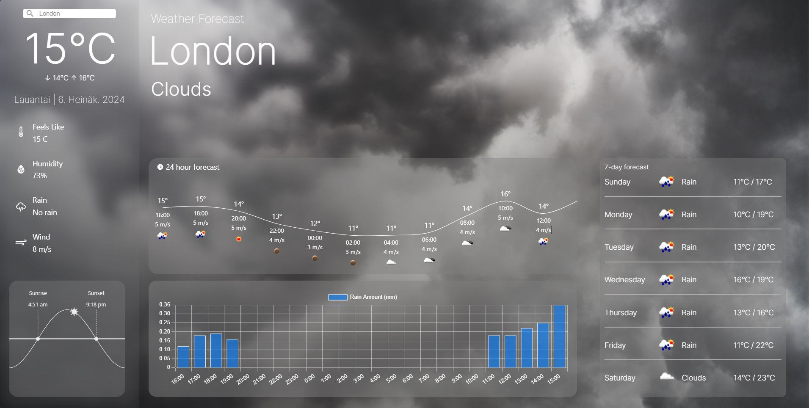

# Weather App

This is a weather forecasting application built with React. It fetches weather data from an API and displays a 24-hour forecast.

## Project Structure

The project is structured as follows:

- [`src/`](command:_github.copilot.openRelativePath?%5B%7B%22scheme%22%3A%22file%22%2C%22authority%22%3A%22%22%2C%22path%22%3A%22%2Fc%3A%2FUsers%2FElmer%2FDesktop%2FReact-Weather-App%2Fsrc%2F%22%2C%22query%22%3A%22%22%2C%22fragment%22%3A%22%22%7D%5D "c:\Users\Elmer\Desktop\React-Weather-App\src\") - Contains the source code for the application.
- `api/` - Contains the API calls.
- [`components/`](command:_github.copilot.openSymbolFromReferences?%5B%7B%22%24mid%22%3A1%2C%22path%22%3A%22%2Fc%3A%2FUsers%2FElmer%2FDesktop%2FReact-Weather-App%2Fsrc%2Fcomponents%2FMainLayout%2FRainChart.jsx%22%2C%22scheme%22%3A%22file%22%7D%2C%7B%22line%22%3A0%2C%22character%22%3A0%7D%5D "src/components/MainLayout/RainChart.jsx") - Contains the React components.
- [`hooks/`](command:_github.copilot.openSymbolFromReferences?%5B%7B%22%24mid%22%3A1%2C%22path%22%3A%22%2Fc%3A%2FUsers%2FElmer%2FDesktop%2FReact-Weather-App%2Fsrc%2Fhooks%2FuseWeatherData.js%22%2C%22scheme%22%3A%22file%22%7D%2C%7B%22line%22%3A0%2C%22character%22%3A0%7D%5D "src/hooks/useWeatherData.js") - Contains the custom React hooks.
- [`public/`](command:_github.copilot.openRelativePath?%5B%7B%22scheme%22%3A%22file%22%2C%22authority%22%3A%22%22%2C%22path%22%3A%22%2Fc%3A%2FUsers%2FElmer%2FDesktop%2FReact-Weather-App%2Fpublic%2F%22%2C%22query%22%3A%22%22%2C%22fragment%22%3A%22%22%7D%5D "c:\Users\Elmer\Desktop\React-Weather-App\public\") - Contains the static files served by the application.

## Installation

1. Clone the repository.
2. Install the dependencies using `npm install`.
3. Create a [`.env.local`](command:_github.copilot.openRelativePath?%5B%7B%22scheme%22%3A%22file%22%2C%22authority%22%3A%22%22%2C%22path%22%3A%22%2Fc%3A%2FUsers%2FElmer%2FDesktop%2FReact-Weather-App%2F.env.local%22%2C%22query%22%3A%22%22%2C%22fragment%22%3A%22%22%7D%5D "c:\Users\Elmer\Desktop\React-Weather-App\.env.local") file in the root directory and add your API keys.

## Running the Application

To start the application, run `npm start`.

## Building the Application

To build the application for production, run `npm run build`.

## Testing

To run the tests, use `npm run test`.

